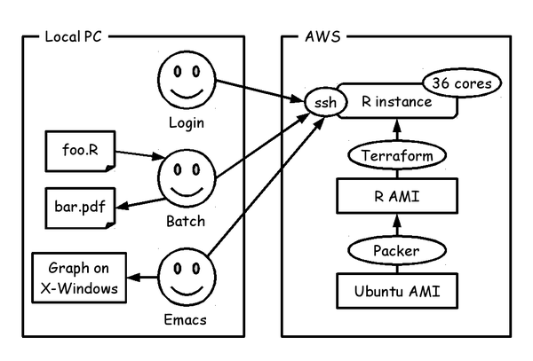

# Kick-R: Get your own R instance with 36 cores on AWS



## Setup

### Debian GNU/Linux

Install packages that are needed by Kick-R.

```
$ sudo apt-get install git make bundler unzip
```

Install [Packer](https://www.packer.io/) and [Terraform](https://terraform.io/).

```
$ cd /usr/local/bin
$ wget https://releases.hashicorp.com/packer/0.8.6/packer_0.8.6_linux_amd64.zip
$ wget https://releases.hashicorp.com/terraform/0.6.7/terraform_0.6.7_linux_amd64.zip
$ sudo unzip -x packer_0.8.6_linux_amd64.zip
$ sudo unzip -x terraform_0.6.7_linux_amd64.zip
```

Set up environment value for AWS KEY.

```
$ export AWS_ACCESS_KEY_ID=XXXXXXXXXXXXXXXXXXXX
$ export AWS_SECRET_ACCESS_KEY=YYYYYYYYYYYYYYYYYYYYYYYYYYYYYYYYYYYYYYYY
```

### Mac OS X

T.B.D.

### Windows

T.B.D.

## How to use

Run command "make login" to boot and login R instance on AWS.

```
$ git clone https://github.com/centillion-tech/kick-r.git
$ cd kick-r
$ make
$ make ssh-config > ~/.ssh/config
$ ssh kick-r
ubuntu@ip-10-189-135-202:~$ R --version | head -1
R version 3.0.2 (2013-09-25) -- "Frisbee Sailing"
```

If you want to use Emacs ESS mode for remote R process ([detail](http://ess.r-project.org/Manual/ess.html#ESS-processes-on-Remote-Computers)), and run R process with **M-x R** and simply type **/ssh:kick-r:**.

After all, run command "make distclean" to shutdown the R instance.

```
$ make distclean
```

## Commands

### make setup

Create an AMI that includes R environment on AWS.

### make

Boot an AWS instance using the AMI. After running the command, ssh connection of the AWS instance is ready. And the AWS instance has already have R environment.

### make login

Login the AWS instance.

### make ssh-config

Print config for .ssh/config.

```
$ make ssh-config > ~/.ssh/config
$ slogin kick-r
```

### make job

Run R script at the AWS instance.

```
$ make job R=~/some/where/foo.R
```

### make clean

Shutdown the AWS instance.

### make distclean

Remove the AMI.

## See also

* [AWSに36コア環境作ってR言語プログラミング \| その他ブログ](https://kiwamu.wordpress.com/2015/12/18/aws%e4%b8%8a%e3%81%abr%e8%a8%80%e8%aa%9e%e7%92%b0%e5%a2%83%e3%82%92%e6%a7%8b%e7%af%89%e3%81%97%e3%81%a6/)

## License

The MIT License (MIT)

Copyright (c) 2015 Centillion Japan Co.,Ltd.
