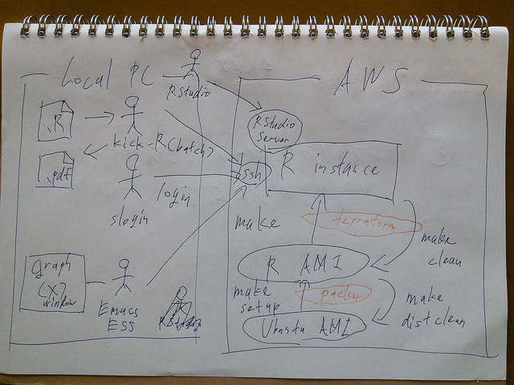

# Kick-R: Boot R instance on AWS



## Setup

### Debian GNU/Linux

Install packages that are needed by Kick-R.

```
$ sudo apt-get install xxx
```

Install [Packer](https://www.packer.io/) and [Terraform](https://terraform.io/).

```
$ cd ~/bin
$ unzip -x packer_0.7.5_linux_amd64.zip
$ unzip -x terraform_0.4.2_linux_amd64.zip
$ export PATH=$HOME/bin:$PATH
```

Set up environment value for AWS KEY.

```
export AWS_ACCESS_KEY_ID=XXXXXXXXXXXXXXXXXXXX
export AWS_SECRET_ACCESS_KEY=YYYYYYYYYYYYYYYYYYYYYYYYYYYYYYYYYYYYYYYY
```

### Mac OS X

T.B.D.

### Windows

T.B.D.

## How to use

```
$ git clone https://github.com/centillion-tech/kick-r.git
$ cd kick-r
$ make login
ubuntu@ip-10-189-135-202:~$ R --version | head -1
R version 3.0.2 (2013-09-25) -- "Frisbee Sailing"
$ make distclean
```

## Commands

### make setup

Create an AMI that includes R environment on AWS.

### make

Boot an AWS instance using the AMI. After running the command, ssh connection of the AWS instance is ready. And the AWS instance has already have R environment.

### make login

Login the AWS instance.

### make clean

Shutdown the AWS instance.

### make distclean

Remove the AMI.
